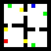
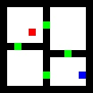
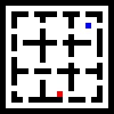
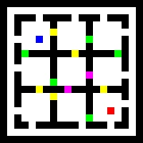
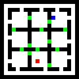

# GridWorld

This is a simple reinforcement learning environment for verifying correctness of my model.

This environment is designed to

- be portable
- follow the gym interface
- be easy to modify and extend

#### Game Intro
You are going to control an agent to collect coins and reach goals.

The agent can perform one of four actions, up, down, left or right.Then default version is deterministic, but you can add stochasticity.

Some noise might be added to increase the difficulty,see `fourrooms_coin.py` for details.

#### Demo
Girdworld with an agent (blue) and a goal(red). Rewards are -0.1 if the goal is not reached, and 10 if reached.

Girdworld with a coin(yellow). A coin will give $reward=10$ and be eaten.

Girdworld with more coins.

Gridworld with background dynamic noise.

Gridworld with background dynamic noise and an irrelevant dark block.

Gridworld with coins, waters(green) which act as obstacles, and more complex dynamics shown by a piece of discription. It's not guaranteed that the agent can reach the goal (to be completed).

Gridworld with gates(green), each of which can be a coin/water/wall according to the description. Different from the previous one, the agent can pass the water and get $reward=-1$.

Gridworld with nine rooms

Nine rooms with gates. Gates in common color are of one type(coin/water/wall), which is given by the description.

Nine rooms with gates -v2. Similar to fourrooms with gates, each gate has a type, which is given by the description.

#### Specifics

`fourrooms.py`and `fourrooms_coin.py` define two main game classes.Some details are in the beginning of the program files.

`fourrooms_water.py` defines the game with waters and complex dynamics.

`test_util.py` and `test_baseline.py` both provide some test scripts.`test_baseline.py` is based on [Stable Baselines](https://github.com/hill-a/stable-baselines).

`value_iteration.py` can provide knowledge about the game. It is implemented for only non-coin and one-coin cases.

#### Installation
run

`pip install -r requirements_nobaseline.txt`

Then you can use the environment without installation of `tensorflow` and `Stable Baselines`. 

#### Unfinished work
- Finish stable baseline test.
- Add a pygame-like interface.
- More complex dynamics, such as more extra steps.

