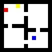
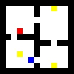

# GridWorld

This is a simple reinforcement learning environment for verifying correctness of my model.

This environment is designed to be

- portable
- following gym interface
- easy to modify and extend

#### Game Intro
You are going to control an agent to collect coins and reach goals.

The agent can perform one of four actions,up, down, left or right.You can add stochasticity.

Some noise might be added to increase the difficulty,see `fourrooms_coin.py` for details.

#### Demo
Girdworld with an agent and a goal.(basic version)

Girdworld with a coin.

Girdworld with more coins.

Gridworld with background dynamic noise.

Gridworld with background dynamic noise and an irrelevant dark block.

#### Specifics

`fourrooms.py`and `fourrooms_coin.py` define two main game classes.Some details are in the beginning of the program files.

`test_util.py` and `test_baseline.py` both provide some test scripts,where `test_baseline.py` is based on [Stable Baselines](https://github.com/hill-a/stable-baselines).

`value_iteration.py` can provide knowledge about the game. It has only been implemented for non-coin and one-coin cases.

#### Installation
run

`pip install -r requirements_nobaseline.txt`

Then you can use the environment without installation of `tensorflow` and `Stable Baselines`. 

#### Unfinished work
- Finish stable baseline test.

- Add a pygame-like interface.
